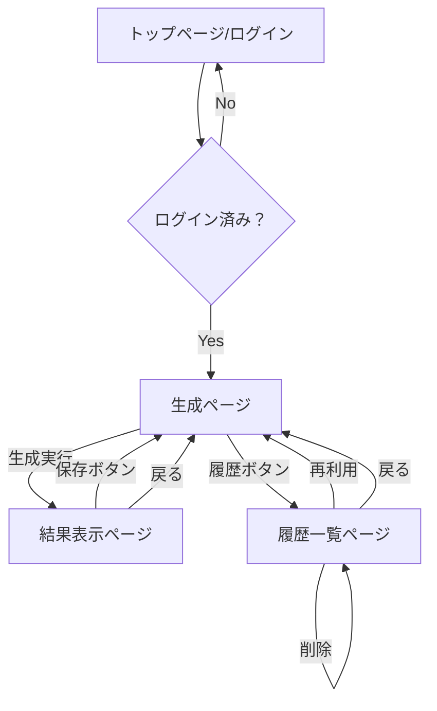
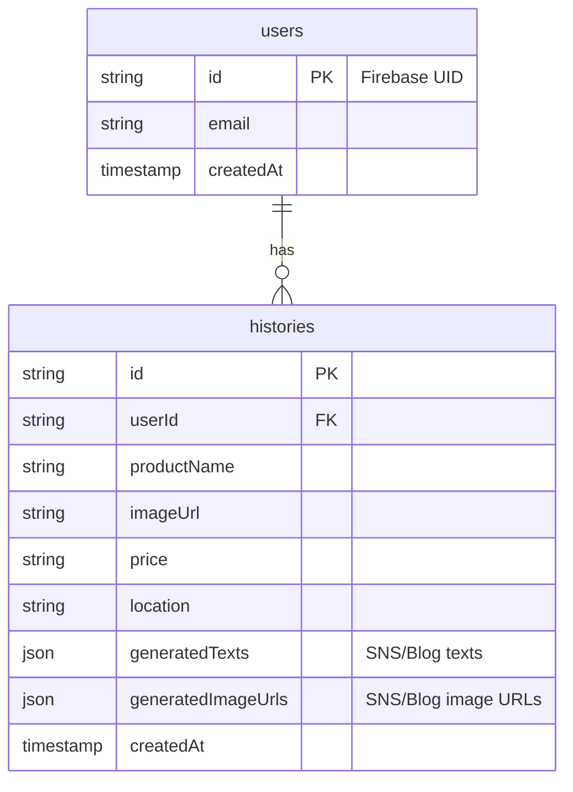

# 基本設計書

## 1. はじめに

### 1.1. 目的
本ドキュメントは、「SNS投稿文＋ブログ記事＋背景画像自動生成Webツール」の基本設計を定義する。要件定義書に基づき、システムの全体像、主要機能、画面構成、技術仕様などを明確にすることを目的とする。

### 1.2. 対象読者
本ドキュメントは、開発者、プロジェクトマネージャー、および関係者を対象とする。

## 2. システム構成

### 2.1. システムアーキテクチャ
本システムは、クライアントサイドで動作するSPA（Single Page Application）と、サーバーサイドのBFF（Backend For Frontend）、および外部API（Gemini API）で構成される。

```mermaid
graph TD
    subgraph "ユーザー環境"
        A[クライアント (PC/スマホブラウザ)]
    end

    subgraph "サーバー環境"
        B[BFF (Backend For Frontend)]
        C[データベース (履歴保存用)]
    end

    subgraph "外部サービス"
        D[Gemini API]
    end

    A -- HTTPS --> B
    B -- API Call --> D
    B -- CRUD --> C
```

*   **クライアント**: React (Next.js) を使用したSPA。ユーザーインターフェースを提供し、BFFと通信する。
*   **BFF**: Node.js (Express) を使用。クライアントからのリクエストを受け、Gemini APIへのリクエスト中継、プロンプト生成、履歴データのCRUD処理を行う。
*   **データベース**: 履歴保存用にFirestoreまたはPostgreSQLなどのRDBを利用する。
*   **Gemini API**: テキスト生成、画像生成を行う。

### 2.2. 技術スタック
*   **フロントエンド**: React (Next.js), TypeScript, Tailwind CSS
*   **バックエンド (BFF)**: Node.js, Express, TypeScript
*   **データベース**: Firestore (NoSQL) または PostgreSQL (SQL)
*   **API**: Gemini API
*   **認証**: Firebase Authentication (OAuth2)
*   **開発/実行環境**: VSCode, Gemini CLI, Node.js, Docker

## 3. 機能設計

### 3.1. 機能一覧
| 大機能 | 中機能 | 概要 |
| :--- | :--- | :--- |
| ユーザー認証 | ログイン/ログアウト | OAuth2（Google, etc.）による認証機能。 |
| コンテンツ生成 | 入力フォーム | 商品名、画像URL、価格、場所を入力するフォーム。 |
| | 短文案生成 | 入力情報と固定プロンプトを基に、SNS用短文案を3案生成する。 |
| | 生成案選択 | ユーザーが3案の中から1案を選択する。 |
| | 詳細コンテンツ生成 | 選択された案を基に、Instagram用、ブログ用のコンテンツと画像を生成する。 |
| 出力 | テキストコピー | 生成されたテキスト（タイトル、本文、ハッシュタグ）をクリップボードにコピーする。 |
| | 画像ダウンロード | 生成された画像をダウンロードする。 |
| 履歴管理 | 履歴保存 | 生成結果（入力情報、生成テキスト、画像URL）をデータベースに保存する（直近10件）。 |
| | 履歴表示 | 保存された履歴の一覧を表示する。 |
| | 履歴再利用 | 履歴を選択し、入力フォームに内容を復元して再生成や編集を行う。 |
| | 履歴削除 | 指定した履歴を削除する。 |

## 4. 画面設計

### 4.1. 画面遷移図


### 4.2. 画面レイアウト（ワイヤーフレーム）

#### 4.2.1. 生成ページ (`/generate`)
*   **ヘッダー**: ロゴ、履歴ページへのリンク、ログアウトボタン
*   **入力フォーム**:
    *   商品名 (テキスト入力)
    *   商品画像URL (URL入力)
    *   価格 (数値入力)
    *   買える場所 (テキスト入力)
    *   生成ボタン
*   **短文案選択エリア**:
    *   生成された短文案3つをカード形式で表示。
    *   各カードに選択ボタンを配置。

#### 4.2.2. 結果表示ページ (`/result`)
*   **ヘッダー**: ロゴ、履歴ページへのリンク、ログアウトボタン
*   **SNS用エリア**:
    *   タイトル (表示＋コピーボタン)
    *   本文 (表示＋コピーボタン)
    *   ハッシュタグ (表示＋コピーボタン)
    *   背景画像 (表示＋ダウンロードボタン)
*   **ブログ用エリア**:
    *   見出し構造＋本文 (表示＋コピーボタン)
    *   背景画像 (表示＋ダウンロードボタン)
*   **参考画像エリア**:
    *   テキスト・商品入りデザイン案 (表示＋ダウンロードボタン)
*   **アクションボタン**:
    *   保存ボタン
    *   戻るボタン (生成ページへ)

#### 4.2.3. 履歴一覧ページ (`/history`)
*   **ヘッダー**: ロゴ、生成ページへのリンク、ログアウトボタン
*   **履歴リスト**:
    *   保存された履歴をカード形式で一覧表示（商品名、生成日時など）。
    *   各カードに「再利用」「削除」ボタンを配置。

## 5. API設計

### 5.1. BFF APIエンドポイント
| エンドポイント | HTTPメソッド | 概要 |
| :--- | :--- | :--- |
| `/api/generate/short-texts` | POST | 短文案を3案生成する |
| `/api/generate/contents` | POST | 選択された短文案に基づき、SNS用・ブログ用コンテンツを生成する |
| `/api/history` | GET | ログインユーザーの履歴を一覧取得する |
| `/api/history` | POST | 生成結果を履歴に保存する |
| `/api/history/:id` | DELETE | 指定した履歴を削除する |

## 6. データベース設計 (ER図)

`users` テーブルと `histories` テーブルを設計する。


*   **users**: ユーザー情報を格納。
*   **histories**: ユーザーごとの生成履歴を格納。`generatedTexts` と `generatedImageUrls` はJSON形式で柔軟にデータを保持する。

## 7. 非機能要件設計

### 7.1. セキュリティ
*   **認証**: Firebase Authenticationを利用し、OAuth2.0（Google認証など）を実装する。BFFはリクエストヘッダーのIDトークンを検証し、ユーザーを識別する。
*   **APIキー管理**: Gemini APIのキーはサーバーサイド（BFF）の環境変数として厳重に管理し、クライアントには公開しない。

### 7.2. パフォーマンス
*   **APIレスポンス**: Gemini APIへのリクエストは非同期で処理する。クライアントにはローディング表示を行い、体感速度を向上させる。
    *   テキスト生成: 3秒以内
    *   画像生成: 10秒以内
*   **フロントエンド**: Next.jsのISR (Incremental Static Regeneration) やSSG (Static Site Generation) を活用し、静的コンテンツの表示を高速化する。

### 7.3. 拡張性
*   **多言語対応**: プロンプトやUIのテキストを言語ファイル（例: `ja.json`, `en.json`）として分離し、将来的な多言語対応を容易にする。
*   **コンポーネント設計**: 機能ごとにコンポーネントを分割し、再利用性とメンテナンス性を高める。
