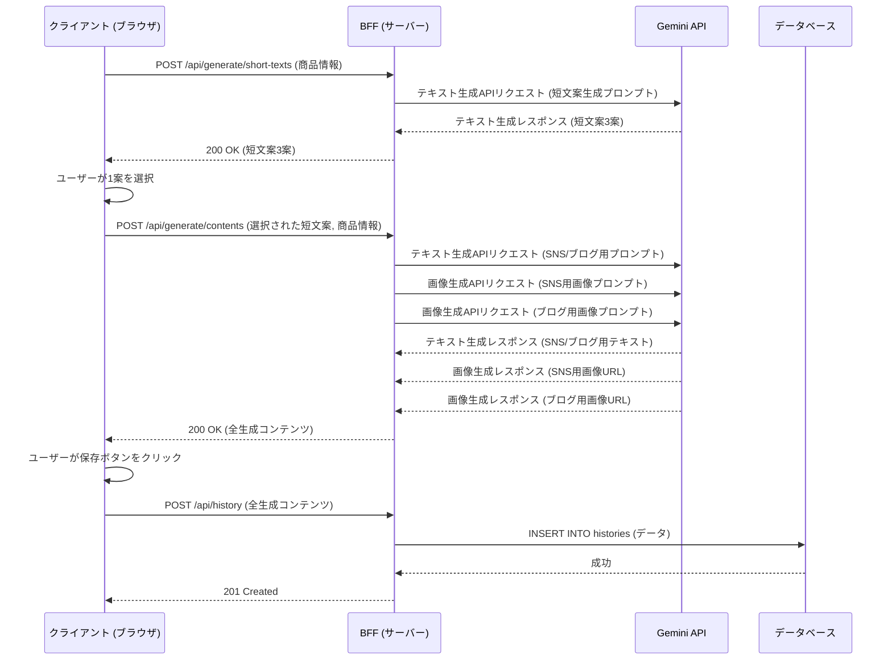

# 詳細設計書

## 1. はじめに

### 1.1. 目的
本ドキュメントは、基本設計書に基づき、「SNS投稿文＋ブログ記事＋背景画像自動生成Webツール」の各機能における詳細な仕様を定義する。実装担当者が本ドキュメントを参照することで、具体的なコーディングが可能になることを目的とする。

## 2. シーケンス図

### 2.1. コンテンツ生成フロー
ユーザーが情報を入力し、コンテンツが生成されるまでの一連の流れ。



## 3. API詳細設計

### 3.1. `POST /api/generate/short-texts`
*   **概要**: 短文案を3案生成する。
*   **リクエストボディ**:
    ```json
    {
      "productName": "string",
      "imageUrl": "string (url)",
      "price": "string",
      "location": "string"
    }
    ```
*   **レスポンスボディ (200 OK)**:
    ```json
    {
      "shortTexts": [
        "string (80-120文字)",
        "string (80-120文字)",
        "string (80-120文字)"
      ]
    }
    ```

### 3.2. `POST /api/generate/contents`
*   **概要**: SNS用・ブログ用コンテンツを生成する。
*   **リクエストボディ**:
    ```json
    {
      "productName": "string",
      "imageUrl": "string (url)",
      "price": "string",
      "location": "string",
      "selectedShortText": "string"
    }
    ```
*   **レスポンスボディ (200 OK)**:
    ```json
    {
      "sns": {
        "title": "string (20文字以内)",
        "body": "string (100-150文字)",
        "hashtags": ["string", "string", ...],
        "imageUrl": "string (url, 1080x1080)"
      },
      "blog": {
        "content": "string (markdown, 1200-2000文字)",
        "imageUrl": "string (url, 1200x630)"
      },
      "referenceImage": {
        "imageUrl": "string (url)"
      }
    }
    ```

### 3.3. `GET /api/history`
*   **概要**: ログインユーザーの履歴を最大10件取得する。
*   **レスポンスボディ (200 OK)**:
    ```json
    {
      "histories": [
        {
          "id": "string",
          "productName": "string",
          "createdAt": "string (ISO 8601)",
          // 他の履歴データも含む
        },
        ...
      ]
    }
    ```

## 4. データベーステーブル詳細

### 4.1. `histories` テーブル
| カラム名 | データ型 | 説明 | 制約 |
| :--- | :--- | :--- | :--- |
| `id` | `VARCHAR(255)` | 履歴ID (UUID) | PRIMARY KEY |
| `user_id` | `VARCHAR(255)` | ユーザーID | NOT NULL, FOREIGN KEY (users.id) |
| `product_name` | `TEXT` | 商品名 | NOT NULL |
| `image_url` | `TEXT` | 商品画像URL | |
| `price` | `VARCHAR(255)` | 価格 | |
| `location` | `TEXT` | 購入場所 | |
| `generated_content` | `JSONB` | 生成された全コンテンツ（SNS, Blog, 参考画像） | NOT NULL |
| `created_at` | `TIMESTAMP WITH TIME ZONE` | 作成日時 | NOT NULL, DEFAULT CURRENT_TIMESTAMP |

*   **`generated_content` カラムのJSON構造例**:
    ```json
    {
      "input": {
        "productName": "...",
        "imageUrl": "...",
        "price": "...",
        "location": "..."
      },
      "output": {
        "sns": { ... },
        "blog": { ... },
        "referenceImage": { ... }
      }
    }
    ```

## 5. プロンプト詳細設計

### 5.1. 固定プロンプト（システムプロンプト）
BFF内部で以下のテンプレートを保持する。

```text
あなたはマーケティングと広報の専門家です。ユーザーが入力した「商品名・商品画像URL・価格・買える場所」の情報をもとに、以下を考慮して商品を説明してください。

* 誰の（ターゲット）
* 何を（課題や欲求）
* どのように解決するのか（商品・サービスの特徴）
* ターゲットの人口動態（年代、性別、居住地など）
* ターゲットのライフスタイル（行動パターン、価値観、嗜好など）
```

### 5.2. 短文案生成プロンプト
```text
${固定プロンプト}

以下の商品情報に基づいて、商品の魅力を伝えるための3つの短文案（80〜120文字）を提案してください。各案は簡潔で感情を引き出すものにしてください。

# 商品情報
* 商品名: ${productName}
* 商品画像URL: ${imageUrl}
* 価格: ${price}
* 買える場所: ${location}

# 出力形式 (JSON配列)
["案1", "案2", "案3"]
```

### 5.3. 詳細コンテンツ生成プロンプト
```text
${固定プロンプト}

以下の商品情報と、ユーザーが選択した短文案をもとに、SNS用とブログ用のコンテンツを生成してください。

# 商品情報
* 商品名: ${productName}
* 商品画像URL: ${imageUrl}
* 価格: ${price}
* 買える場所: ${location}

# 選択された短文案
${selectedShortText}

# 生成指示
以下のJSON形式で出力してください。
{
  "sns": {
    "title": "タイトル（20文字以内）",
    "body": "本文（100〜150文字）",
    "hashtags": ["ハッシュタグ1", "ハッシュタグ2", "ハッシュタグ3", "ハッシュタグ4", "ハッシュタグ5"],
    "imagePrompt": "SNS用の背景画像を生成するための英語のプロンプト"
  },
  "blog": {
    "content": "H1, H2, H3の見出し構造を含むブログ記事本文（1,200〜2,000文字）。Markdown形式で記述。",
    "imagePrompt": "ブログ用の背景画像を生成するための英語のプロンプト"
  },
  "referenceImage": {
    "imagePrompt": "商品画像(${imageUrl})をメインに配置し、キャッチーなテキストを添えた魅力的な広告デザインを生成するための英語のプロンプト"
  }
}
```

## 6. UIコンポーネント詳細
（ここでは主要なコンポーネントのみ記述）

### 6.1. `CopyButton` コンポーネント
*   **Props**: `textToCopy: string`
*   **機能**:
    *   クリックすると `textToCopy` の内容をクリップボードにコピーする (`navigator.clipboard.writeText`)。
    *   コピー成功後、一時的に「コピーしました！」などのフィードバックを表示する。

### 6.2. `HistoryCard` コンポーネント
*   **Props**: `history: HistoryItem` (id, productName, createdAtなどを含むオブジェクト)
*   **機能**:
    *   商品名と生成日時を表示する。
    *   「再利用」ボタン: クリックすると、対応する履歴IDを引数に `useHistory` フックの再利用関数を呼び出す。
    *   「削除」ボタン: クリックすると、確認ダイアログを表示後、対応する履歴IDを引数に `useHistory` フックの削除関数を呼び出す。
